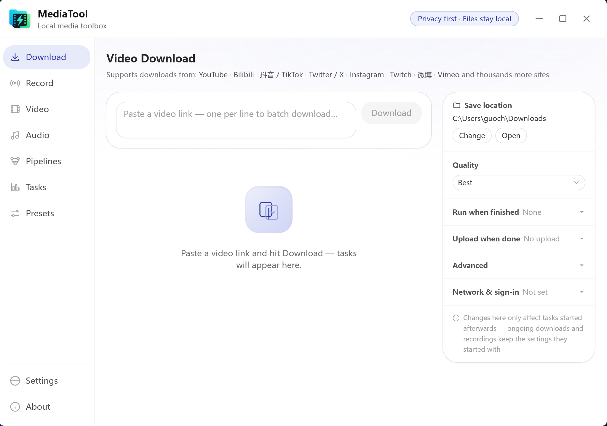
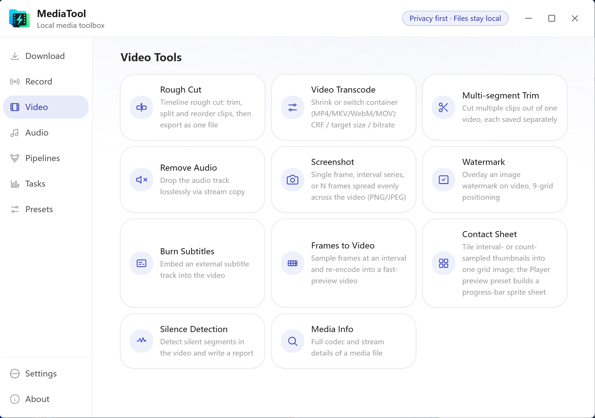
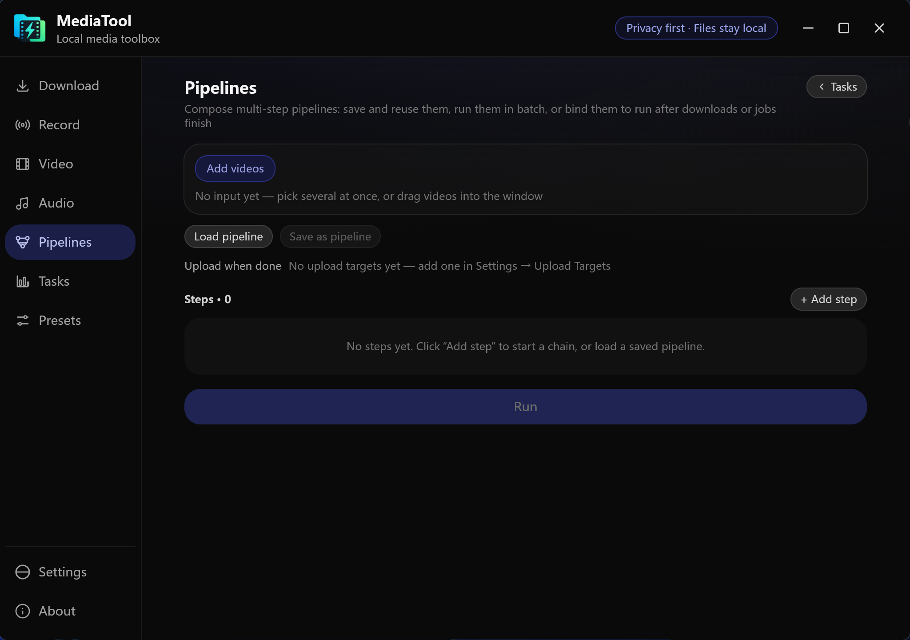
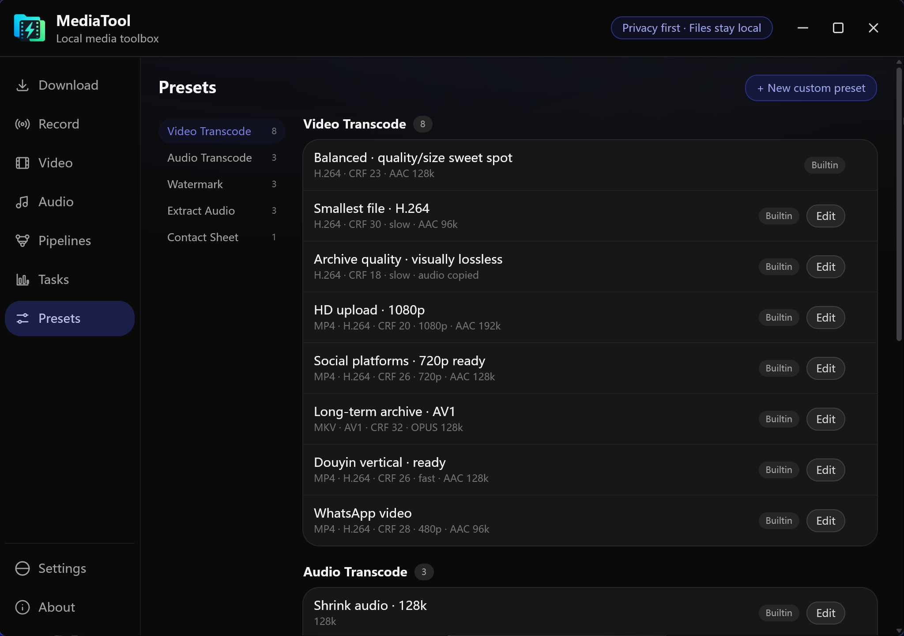
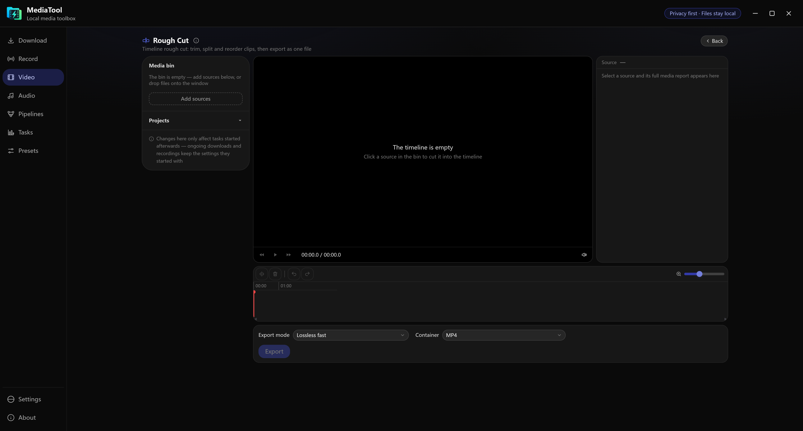

[🇨🇳 中文](README.zh.md) | [🇺🇸 English](README.md)

---

# MediaTool

**Your entire media workflow in one local app.** Download and record from the web, compress and convert video & audio, chain everything into automated pipelines, and push the results wherever you want — no cloud, no accounts, no uploads you didn't ask for. Every byte is processed on your own machine with FFmpeg.

## 📸 Screenshots

<table>
  <tr>
    <td width="50%"> Video download — paste links, pick a quality, batch it</td>
    <td width="50%"> Eleven video tools on one screen</td>
  </tr>
  <tr>
    <td> Pipeline builder (dark theme)</td>
    <td> Built-in and custom presets (dark theme)</td>
  </tr>
  <tr>
    <td colspan="2"> Timeline rough cut — trim, split and reorder clips, then export as one file (dark theme)</td>
  </tr>
</table>

## ✨ Features

### 📥 Download & record from the web

- **Video downloader** powered by yt-dlp — thousands of supported sites including YouTube, Bilibili, TikTok/抖音, X/Twitter, Instagram, Twitch, Weibo and Vimeo. Grab the best available quality or pick an exact resolution.
- **Livestream recorder** powered by Streamlink — YouTube, Twitch, Bilibili, 斗鱼, 虎牙, Kick, NicoLive and ~155 more platforms.
- **Live monitors** — register a channel once and MediaTool watches it; recording starts automatically the moment the stream goes live.

### 🎬 Video tools

- **Compress** — H.264, HEVC, VP9 and AV1 (SVT-AV1) with CRF, fixed-bitrate or *target file size* modes, plus resolution, frame-rate and encoding-speed presets.
- **Convert** — any container/codec combo (MP4 · MKV · WebM · MOV × H.264 · HEVC · VP9 · AV1); switching containers auto-matches the right codecs.
- **Trim** — multi-segment cutting in lossless keyframe mode or precise re-encode mode.
- **Subtitle** — burn in or soft-mux external subtitle files.
- **Watermark** — image overlay with 9-position anchoring, scale, margin and opacity controls.
- **Screenshots & frames** — extract a single frame or an interval series to PNG/JPEG; sample frames into a time-lapse video; build contact sheets / player-preview sprite grids.
- **Remove audio** — lossless mute via stream copy.
- **Silence detector** — find silent segments and export a report, tuned by threshold and minimum length.
- **Media inspector** — a full ffprobe report for any file, with one-click metadata stripping.

### 🎧 Audio tools

- **Compress & convert** between MP3, AAC, M4A, Opus and FLAC at any bitrate.
- **Extract audio** from any video, losslessly or re-encoded.
- **Volume** — loudness normalization or manual gain.
- **Merge** — concatenate audio files.

### 🔗 Automated pipelines

- **Workflow builder** — chain multiple tools into a reusable pipeline; each step feeds the previous one's output, with a single flattened progress bar.
- **Post-processing on completion** — bind a pipeline to a download, recording or job and it runs automatically when the source finishes.
- **Smart fallback** — a lossless remux that can't fit its container is automatically swapped for the right transcode, and the run tells you why.

### ☁️ Upload when it's done

- Push finished outputs straight to **WebDAV** (坚果云, NAS, Alist…), **Telegram**, **YouTube**, **Google Drive** or **OneDrive**.
- Streaming transfers with real-time progress, cancellation and OAuth token refresh — credentials live only in the app, never on disk in the backend.

### ⚡ Batch that behaves

- Drag in dozens of files and run them **concurrently** across different tools.
- A unified task dock with progress, speed, ETA, retry and cancel; drag to reorder.
- **Name-conflict policy** (auto-rename / skip / overwrite) and customizable output suffixes — your originals are never clobbered by surprise.
- **Output size estimation** — theoretical prediction plus an actual sample encode when you need precision.

### 🎛 Built for quality and speed

- **GPU encoding, auto-detected** — NVIDIA NVENC, Intel QSV, Apple VideoToolbox, AMD AMF and VAAPI are probed at startup and offered as one-click options.
- **Presets everywhere** — built-in recipes per tool, plus your own custom presets, ready in the presets bar.

### 🔒 Private by design

- 100% local processing — nothing ever leaves your machine unless you configure an upload target.
- **Auto-updates** keep you current without reinstalling.
- **Bilingual interface** (中文 / English) with light & dark themes.

## 🧪 Stability notes

A few features are implemented and covered by unit tests, but have never been verified end-to-end against real accounts or services. Please keep that in mind:

- **Auto-upload when done (WebDAV / Google Drive / OneDrive / Telegram)** — OAuth sign-in has only been tested against a local mock server. Interrupted large uploads do **not** resume; a failed transfer starts over from the beginning.
- **Live push notifications (Telegram / webhook)** — never tested with real Telegram credentials.
- **Cookie sign-in for downloads** — cookies are stored in plain text on your machine (file permissions are tightened on Unix). Export formats differ between browsers, so a pasted cookie file may need adjusting.
- **Web / LAN mode** — the security model was recently tightened: every command is confined to the directories listed in the config's `roots`. If a path is rejected, add its folder to `roots`.

The core download / transcode / merge / rough-cut features are thoroughly tested and considered stable. If one of the features above misbehaves for you, an issue report is always welcome.

---

  Grab the latest installer from <a href="https://github.com/mnigc/MediaTool/releases">Releases</a> — Windows .exe / .msi, with in-app auto-update.

